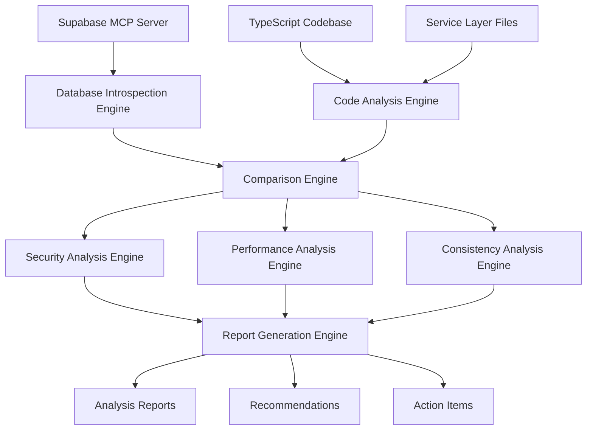

# Design Document

## Overview

The database-codebase review system will perform a comprehensive analysis of the live CityLink Supabase database against the application codebase. The system will use the Supabase MCP server to introspect the actual database schema, analyze TypeScript types and service layer code, and generate detailed reports identifying inconsistencies, security gaps, performance issues, and optimization opportunities.

## Architecture

### Core Components

1. **Database Introspection Engine**
   - Uses Supabase MCP server to query live database schema
   - Extracts table definitions, column types, constraints, indexes, and RLS policies
   - Retrieves stored procedures, functions, and views

2. **Code Analysis Engine**
   - Parses TypeScript domain types and interfaces
   - Analyzes service layer database interactions
   - Identifies data access patterns and query usage

3. **Comparison Engine**
   - Matches database entities with TypeScript types
   - Identifies schema-code mismatches
   - Detects unused database objects and missing code support

4. **Security Analysis Engine**
   - Reviews RLS policies against access patterns
   - Identifies security gaps and over-permissive policies
   - Validates user role-based access controls

5. **Performance Analysis Engine**
   - Analyzes query patterns for optimization opportunities
   - Identifies missing indexes and constraint issues
   - Suggests performance improvements

6. **Report Generation Engine**
   - Generates structured analysis reports
   - Provides actionable recommendations
   - Creates prioritized issue lists

### Data Flow



## Components and Interfaces

### Database Introspection Engine

**Interface:**
```typescript
interface DatabaseSchema {
  tables: TableDefinition[];
  functions: FunctionDefinition[];
  views: ViewDefinition[];
  policies: RLSPolicy[];
  indexes: IndexDefinition[];
  constraints: ConstraintDefinition[];
}

interface TableDefinition {
  name: string;
  columns: ColumnDefinition[];
  primaryKey: string[];
  foreignKeys: ForeignKeyDefinition[];
  constraints: ConstraintDefinition[];
  rlsPolicies: RLSPolicy[];
}
```

**Responsibilities:**
- Connect to live Supabase database via MCP
- Execute schema introspection queries
- Parse and structure database metadata
- Handle connection errors and retries

### Code Analysis Engine

**Interface:**
```typescript
interface CodebaseAnalysis {
  typeDefinitions: TypeDefinition[];
  serviceInteractions: ServiceInteraction[];
  queryPatterns: QueryPattern[];
  dataAccessPatterns: DataAccessPattern[];
}

interface TypeDefinition {
  name: string;
  properties: PropertyDefinition[];
  filePath: string;
  isEntity: boolean;
}
```

**Responsibilities:**
- Parse TypeScript files for domain types
- Analyze service layer database calls
- Extract query patterns and data access methods
- Identify entity relationships in code

### Comparison Engine

**Interface:**
```typescript
interface ComparisonResult {
  schemaMatches: SchemaMatch[];
  mismatches: SchemaMismatch[];
  missingInDatabase: MissingEntity[];
  missingInCode: MissingEntity[];
  inconsistencies: Inconsistency[];
}

interface SchemaMismatch {
  type: 'column_type' | 'nullable' | 'constraint' | 'relationship';
  tableName: string;
  columnName?: string;
  expected: any;
  actual: any;
  severity: 'high' | 'medium' | 'low';
}
```

**Responsibilities:**
- Match database tables with TypeScript interfaces
- Identify type mismatches and missing properties
- Detect unused database objects
- Flag missing database support for code features

## Data Models

### Analysis Report Structure

```typescript
interface AnalysisReport {
  summary: {
    totalTables: number;
    totalTypes: number;
    matchedEntities: number;
    criticalIssues: number;
    warnings: number;
    suggestions: number;
  };
  sections: {
    schemaConsistency: SchemaConsistencyReport;
    securityAnalysis: SecurityAnalysisReport;
    performanceAnalysis: PerformanceAnalysisReport;
    dataModelConsistency: DataModelConsistencyReport;
    unusedObjects: UnusedObjectsReport;
    missingSupport: MissingSupportReport;
  };
  recommendations: Recommendation[];
  actionItems: ActionItem[];
}
```

### Security Analysis Model

```typescript
interface SecurityAnalysisReport {
  rlsPolicyGaps: RLSPolicyGap[];
  overPermissivePolicies: OverPermissivePolicy[];
  missingConstraints: MissingConstraint[];
  authenticationIssues: AuthenticationIssue[];
  dataIsolationIssues: DataIsolationIssue[];
}

interface RLSPolicyGap {
  tableName: string;
  missingPolicies: string[];
  affectedRoles: string[];
  riskLevel: 'critical' | 'high' | 'medium' | 'low';
  recommendation: string;
}
```

### Performance Analysis Model

```typescript
interface PerformanceAnalysisReport {
  missingIndexes: MissingIndex[];
  queryOptimizations: QueryOptimization[];
  nPlusOnePatterns: NPlusOnePattern[];
  inefficientQueries: InefficientQuery[];
  cachingOpportunities: CachingOpportunity[];
}

interface MissingIndex {
  tableName: string;
  columns: string[];
  queryPattern: string;
  estimatedImpact: 'high' | 'medium' | 'low';
  suggestedIndex: string;
}
```

## Error Handling

### Database Connection Errors
- Implement retry logic with exponential backoff
- Graceful degradation when MCP server is unavailable
- Clear error messages for connection issues
- Fallback to migration file analysis if live DB unavailable

### Code Analysis Errors
- Handle TypeScript parsing errors gracefully
- Skip malformed files with warnings
- Provide detailed error context for debugging
- Continue analysis even if some files fail

### Comparison Logic Errors
- Handle edge cases in type matching
- Provide clear error messages for ambiguous matches
- Log detailed information for manual review
- Fail gracefully with partial results

## Testing Strategy

### Unit Tests
- Database introspection query parsing
- TypeScript AST parsing and analysis
- Schema comparison logic
- Report generation functions
- Error handling scenarios

### Integration Tests
- End-to-end analysis workflow
- MCP server connection and querying
- File system access and parsing
- Report output validation
- Performance benchmarking

### Test Data
- Mock database schema responses
- Sample TypeScript files with various patterns
- Known good and bad schema-code combinations
- Edge cases and error conditions

### Validation Tests
- Compare analysis results against known issues
- Verify recommendation accuracy
- Test with different database states
- Validate report completeness and accuracy

## Implementation Phases

### Phase 1: Database Introspection
- Implement MCP server connection
- Build schema extraction queries
- Create database metadata models
- Test with live Supabase database

### Phase 2: Code Analysis
- Implement TypeScript parsing
- Extract service layer interactions
- Build code analysis models
- Test with CityLink codebase

### Phase 3: Comparison Engine
- Implement schema-code matching logic
- Build mismatch detection algorithms
- Create inconsistency reporting
- Test comparison accuracy

### Phase 4: Security & Performance Analysis
- Implement RLS policy analysis
- Build performance optimization detection
- Create security gap identification
- Test analysis quality

### Phase 5: Report Generation
- Implement structured report generation
- Build recommendation engine
- Create actionable item prioritization
- Test report usefulness

### Phase 6: Integration & Optimization
- Integrate all components
- Optimize performance
- Add comprehensive error handling
- Final testing and validation