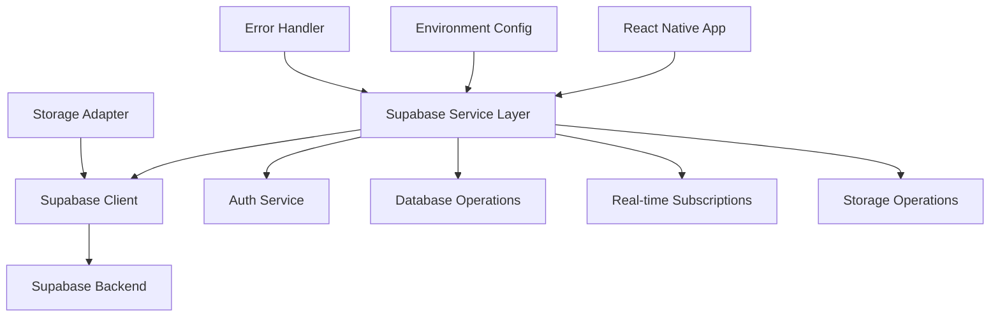

# Supabase Connection Design Document

## Overview

The Supabase connection system provides a robust, secure, and scalable integration between the CityLink React Native application and Supabase backend services. The design leverages the existing architecture while enhancing connection reliability, error handling, and real-time capabilities. The system is built around a centralized client management approach with comprehensive error handling and environment-specific configurations.

## Architecture

### High-Level Architecture



### Core Components

1. **Supabase Client Manager**: Centralized client initialization and management
2. **Configuration Manager**: Environment-specific configuration handling
3. **Query Wrapper**: Standardized error handling and logging for all operations
4. **Real-time Manager**: WebSocket connection management for live updates
5. **Authentication Handler**: Session management and token refresh
6. **Error Recovery System**: Automatic retry logic and connection recovery

## Components and Interfaces

### 1. Enhanced Supabase Client Manager

**Location**: `src/services/supabase.ts`

**Responsibilities**:
- Initialize and maintain Supabase client instance
- Handle environment-specific configurations
- Provide connection validation
- Manage client lifecycle

**Key Methods**:
```typescript
interface SupabaseClientManager {
  getClient(): SupabaseClient | null;
  hasSupabase(): boolean;
  validateConnection(): Promise<boolean>;
  reinitialize(): Promise<void>;
  getConnectionStatus(): ConnectionStatus;
}
```

### 2. Configuration Manager

**Location**: `src/config.ts` (enhanced)

**Responsibilities**:
- Load environment-specific Supabase configurations
- Validate configuration completeness
- Provide fallback configurations for development

**Configuration Structure**:
```typescript
interface SupabaseConfig {
  url: string;
  anonKey: string;
  environment: 'development' | 'staging' | 'production';
  options: {
    auth: AuthOptions;
    global: GlobalOptions;
    realtime: RealtimeOptions;
  };
}
```

### 3. Enhanced Query Wrapper

**Location**: `src/services/supabase.ts` (enhanced)

**Responsibilities**:
- Standardize all database operations
- Implement retry logic with exponential backoff
- Handle rate limiting and connection errors
- Provide consistent error formatting

**Interface**:
```typescript
interface QueryWrapper {
  supaQuery<T>(
    queryFn: QueryFunction<T>,
    options?: QueryOptions
  ): Promise<QueryResult<T>>;
  
  supaRpc<T>(
    functionName: string,
    params?: any,
    options?: RpcOptions
  ): Promise<QueryResult<T>>;
}
```

### 4. Real-time Connection Manager

**Location**: `src/services/realtime.ts` (enhanced)

**Responsibilities**:
- Manage WebSocket connections
- Handle connection drops and reconnection
- Provide subscription lifecycle management
- Sync missed updates after reconnection

**Interface**:
```typescript
interface RealtimeManager {
  subscribe(config: SubscriptionConfig): RealtimeSubscription;
  unsubscribe(subscription: RealtimeSubscription): void;
  getConnectionStatus(): RealtimeStatus;
  reconnect(): Promise<void>;
}
```

### 5. Authentication Integration

**Location**: `src/services/auth.service.ts` (enhanced)

**Responsibilities**:
- Handle Supabase authentication flows
- Manage session persistence
- Implement automatic token refresh
- Provide authentication state management

## Data Models

### Connection Status Model
```typescript
interface ConnectionStatus {
  isConnected: boolean;
  lastConnected: Date | null;
  connectionQuality: 'excellent' | 'good' | 'poor' | 'offline';
  latency: number | null;
}
```

### Query Result Model
```typescript
interface QueryResult<T> {
  data: T | null;
  error: string | null;
  count?: number | null;
  metadata?: {
    executionTime: number;
    retryCount: number;
    fromCache: boolean;
  };
}
```

### Subscription Configuration Model
```typescript
interface SubscriptionConfig {
  channelName: string;
  table: string;
  filter?: string;
  event?: 'INSERT' | 'UPDATE' | 'DELETE' | '*';
  callback: (payload: RealtimePayload) => void;
  onError?: (error: Error) => void;
  onReconnect?: () => void;
}
```

## Error Handling

### Error Categories

1. **Configuration Errors**: Missing or invalid environment variables
2. **Network Errors**: Connection timeouts, DNS failures
3. **Authentication Errors**: Invalid tokens, expired sessions
4. **Rate Limiting**: API quota exceeded
5. **Database Errors**: Query failures, constraint violations
6. **Real-time Errors**: WebSocket disconnections, subscription failures

### Error Recovery Strategies

1. **Exponential Backoff**: For transient network errors
2. **Token Refresh**: For authentication errors
3. **Connection Retry**: For WebSocket disconnections
4. **Graceful Degradation**: Fallback to cached data when possible
5. **User Notification**: Clear error messages for user-facing issues

### Error Handling Implementation

```typescript
interface ErrorHandler {
  handleError(error: SupabaseError): Promise<ErrorResolution>;
  shouldRetry(error: SupabaseError): boolean;
  getRetryDelay(attemptCount: number): number;
  formatUserError(error: SupabaseError): string;
}
```

## Testing Strategy

### Unit Testing

1. **Client Initialization Tests**
   - Valid configuration scenarios
   - Invalid configuration handling
   - Environment-specific behavior

2. **Query Wrapper Tests**
   - Successful query execution
   - Error handling and retry logic
   - Rate limiting behavior

3. **Real-time Manager Tests**
   - Subscription lifecycle
   - Connection recovery
   - Message handling

### Integration Testing

1. **End-to-End Authentication Flow**
   - Sign up, sign in, sign out
   - Token refresh scenarios
   - Session persistence

2. **Database Operations**
   - CRUD operations across different tables
   - Transaction handling
   - Concurrent operation handling

3. **Real-time Functionality**
   - Live data updates
   - Connection recovery after network issues
   - Multiple subscription management

### Performance Testing

1. **Connection Performance**
   - Initial connection time
   - Query response times
   - Real-time message latency

2. **Error Recovery Performance**
   - Retry mechanism efficiency
   - Reconnection speed
   - Resource usage during errors

### Environment-Specific Testing

1. **Development Environment**
   - Local Supabase instance testing
   - Mock data scenarios
   - Debug logging verification

2. **Production Environment**
   - Production Supabase connectivity
   - Performance under load
   - Security configuration validation

## Security Considerations

### Authentication Security
- Secure token storage using Expo SecureStore
- Automatic token refresh to minimize exposure
- Session timeout handling

### Data Security
- Row Level Security (RLS) policy enforcement
- Encrypted data transmission
- Sensitive data handling in logs

### Configuration Security
- Environment variable validation
- No hardcoded credentials in client code
- Secure key rotation support

## Performance Optimizations

### Connection Pooling
- Reuse existing client connections
- Efficient connection lifecycle management

### Caching Strategy
- Query result caching for frequently accessed data
- Cache invalidation on real-time updates

### Network Optimization
- Request batching where possible
- Compression for large payloads
- Efficient subscription management